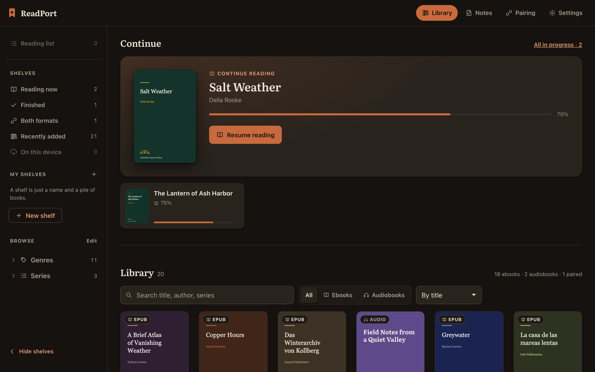
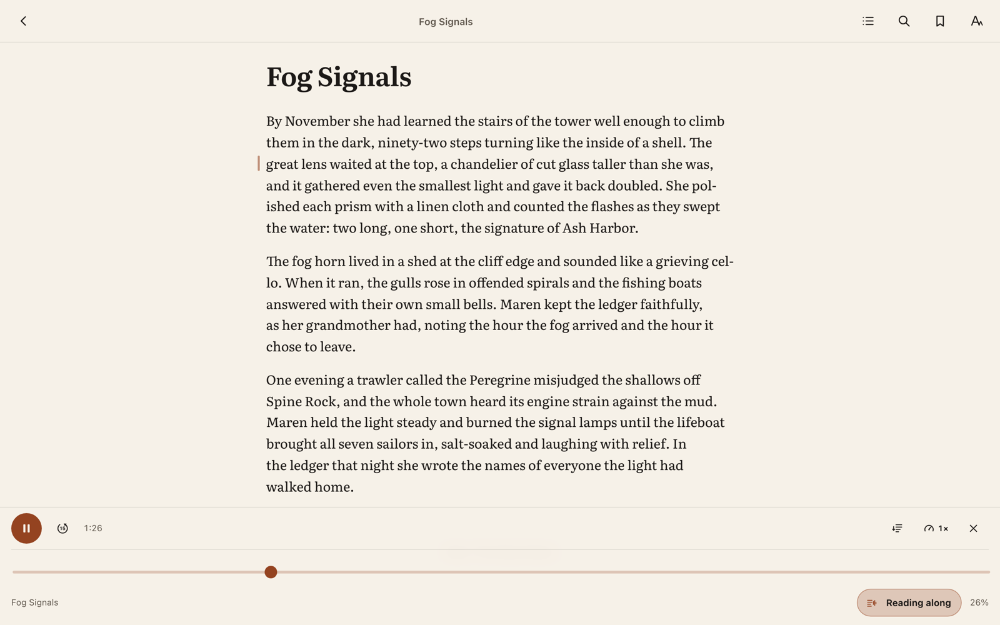
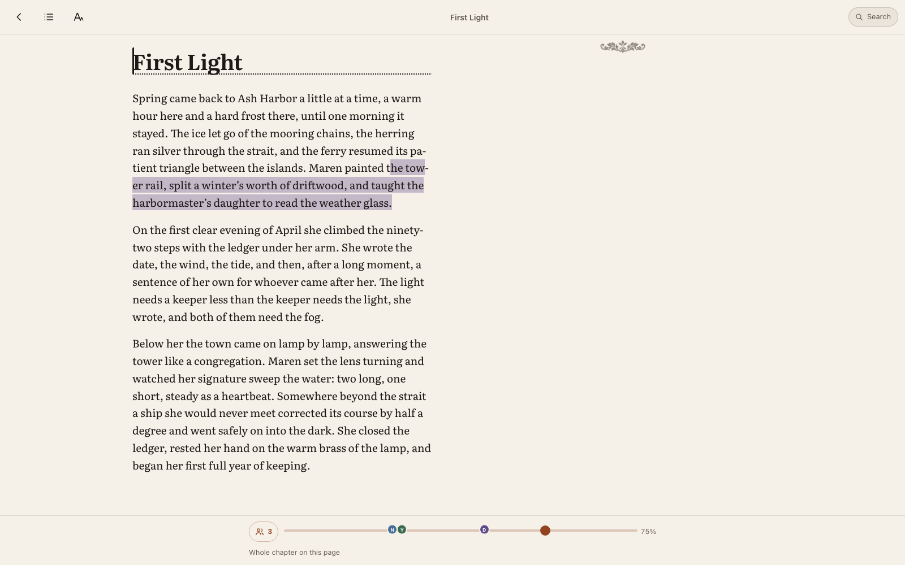
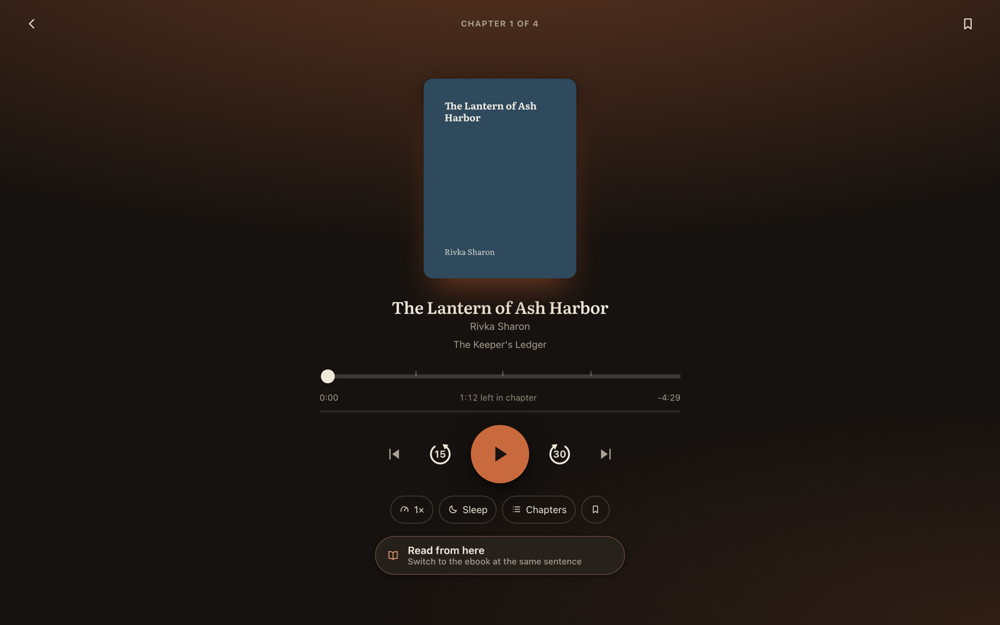
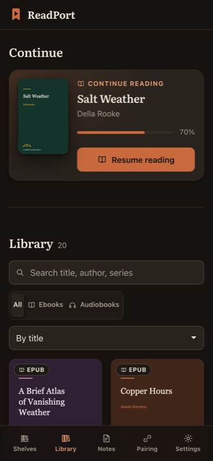
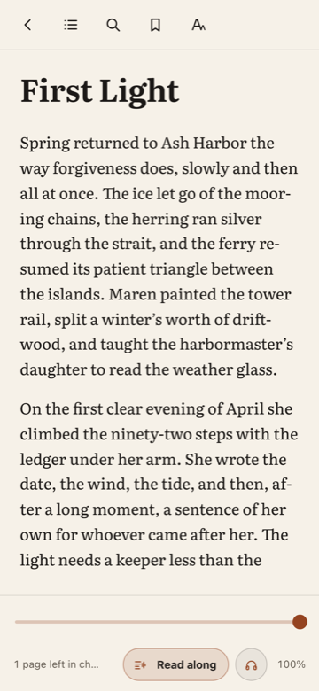
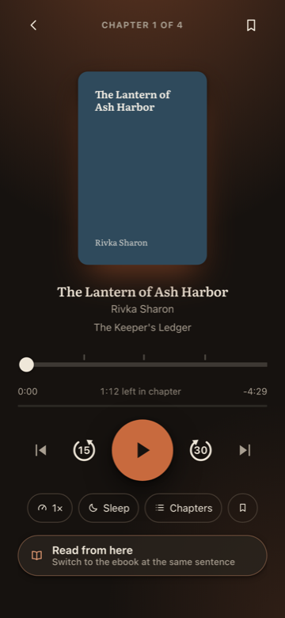

<p align="center">
  
</p>

<h1 align="center">ReadPort</h1>

<p align="center">
  <strong>Read and listen in perfect tandem.</strong><br>
  A self-hosted reader that lines your audiobooks up against your ebooks,<br>
  so you can switch between them mid-sentence.
</p>

<p align="center">
  <a href="https://github.com/ilanKushnir/readport/actions/workflows/ci.yml"></a>
  <a href="LICENSE"></a>
  <a href="https://github.com/ilanKushnir/readport/pkgs/container/readport"></a>
  
</p>

<p align="center">
  
</p>

ReadPort mounts the ebook and audiobook folders you already have, **read-only**,
and puts a calm, installable reading app in front of them. It does not import
your library, rename anything, or write to your files. Calibre, Kavita and
Audiobookshelf keep doing their jobs; ReadPort owns only what it derives:
reading indexes, pair decisions, alignment data, progress and annotations.

---

## Stop at a sentence. Start at the same one.

<p align="center">
  
</p>

Point ReadPort at an ebook and an audiobook of the same work and it lines them
up **by forced alignment** - the words are already in the EPUB, so it never
tries to transcribe them. One 317 MB model, every language, about six minutes
of CPU for a six-hour audiobook.

Then the two editions become one book:

- **Read along** - the narration plays over the page, the page keeps up, and a
  marker tracks the spoken line. Tap any line to send the voice there.
- **Switch either way** at the same sentence, from the reader, the player, or
  the library. Going from page to voice lands slightly _behind_ you, by however
  far the alignment admits it might be wrong - hearing a sentence twice beats
  hearing one you haven't reached.
- **It refuses rather than guesses.** Where the timing has nothing to say, the
  marker is dropped and the bar says so. A pair that fails verification is handed
  back undecided, not aligned wrongly.

Synced text and audio is not a new idea, and
[Storyteller](https://gitlab.com/storyteller-platform/storyteller) got here
first. It is more mature than this, it has native mobile apps, and it produces a
**portable** artifact - an EPUB 3 with Media Overlays that plays in any reader
supporting the spec. If that is what you want, use it.

ReadPort is a different shape. It is a reader over the library you already have
rather than a pipeline that produces a file: it scans your folders, works out by
itself which editions are the same book, never writes to them, and keeps the
timings in a sidecar. Nothing portable comes out of the other end, and the
read-along only works inside ReadPort.

---

## The rest of it

|                                                                                                                                                                |                                                                                                                                                      |
| -------------------------------------------------------------------------------------------------------------------------------------------------------------- | ---------------------------------------------------------------------------------------------------------------------------------------------------- |
|                                                               |                             |
| **A serious EPUB reader.** Paginated spreads or scroll, five themes, seven typefaces, real hyphenation and justification, in-book search, footnote links, RTL. | **A resilient player.** Chapter ticks, time left in chapter, 0.5–3× with pitch held, sleep timer, lock-screen controls, ambient tint from the cover. |

- **Browse what your library already says about itself** - genres, series,
  narrators, publishers, years, ratings, authors and languages, each built from
  the metadata your files already carry, each one click from the grid. A
  book's language is read from its own text, so a tag a tool defaulted does
  not file a Hebrew novel under English, and one button beside Ebooks and
  Audiobooks shows the books in any one of them.
- **Marks you can find again** - highlights in five colours, notes on a dashed
  underline, bookmarks, and one page that searches every mark in every book.
- **Progress that survives** - IndexedDB-first, offline-tolerant, append-only on
  the server. A stale background tab can never overwrite a deliberate rewind.
- **Installable PWA** - offline app shell, per-title downloads with real sizes,
  and a Downloaded shelf that works with no network at all.
- **A household, not a login** - three roles, one-time invite links, per-person
  progress and marks. No open sign-up. Optional header SSO behind your proxy.
- **23 interface languages**, chosen per account, Hebrew and Arabic right-to-left
  while every book keeps its own direction. Everything but English is
  model-generated and says so.
- **Friends** - see where a friend is in a book as a bead on your progress
  bar, in a colour you pick, see when they are in it right now, and put a
  book in front of them with a note. Sharing is consent, per person, and
  nothing in the margins is ever shared.
- **One book, several languages** - link a novel to its translation and a
  friend reading the Russian edition is on your English bar at the matching
  paragraph; carry on in the other language from the paragraph you are on,
  or see a passage as the translation has it. Matches are paragraph to
  paragraph, worked out from the two texts alone.
- **A link to a book** - share one to WhatsApp or anywhere else and it
  previews with the cover; a friend with an account saves it as recommended
  by you, and anyone else can ask to join, for an admin to approve.
- **Your reading** - when you read, how much, how long a sitting runs, how
  often you go back for the thread, and after two weeks of evidence the hour
  of the day you read best. Kept for good, worked out in your own timezone,
  compared only with yourself.
- **Highlights you can hand over** - every mark by book and chapter, sorted
  by place or colour, exported as a clean PDF with the cover on the front.
- **The apps beside it** - Calibre-Web Automated, Audiobookshelf, Shelfmark,
  ReadMeABook, Kavita or anything else, one tap away under the shelves.

<p align="center">
  
  
  
</p>

---

## Quick start

```bash
git clone https://github.com/ilanKushnir/readport && cd readport
cp .env.example .env
echo "RP_SESSION_SECRET=$(openssl rand -hex 32)" >> .env
docker compose up -d --build
```

Open `http://<host>:8383` and create the admin account - there is no default
password and no token to fish out of the log. Out of the box it mounts a
bundled sample library, so there is something to read within a minute; point
`RP_EBOOK_PATH` and `RP_AUDIOBOOK_PATH` in `.env` at your real folders when
you're ready.

**One port** (`8383`). **Three mounts**: your ebooks and audiobooks, both `:ro`,
and one alignment folder that is read-write on purpose - it is the only place
ReadPort ever writes to your library, one `.rpalign` file per pair, so your
alignments survive a rebuild.

> **Before you expose it to the internet:** set `RP_SETUP_TOKEN` so the first-run
> window can't be claimed by a stranger, and set both `RP_TRUST_HTTPS=1` and
> `RP_TRUST_PROXY` behind a reverse proxy. See
> [docs/security.md](docs/security.md).

## What it needs

Docker, your library folders, and patience with one CPU-bound job. Reading,
listening, browsing and pairing need nothing special - a server with no model
installed still does all of it. Alignment is the only heavy part: budget ~2 GB
RAM, 317 MB of disk for the model, and as many threads as the container really
has (`RP_ALIGN_THREADS`, default 4).

Formats: EPUB (no DRM), and `.m4b` / `.mp3` / `.m4a` / `.flac` / `.ogg` /
`.opus`, including one-directory-per-book multi-file audiobooks.

The published image is **amd64 only** - on arm64, build from source.

## What it deliberately doesn't do

No library management, no metadata editing, no renaming, no transcoding, no DRM
removal, no acquiring books. No PDF, MOBI or comics. No cloud, no account, no
telemetry - the single outbound request in the whole app is the optional model
download. PWA install needs HTTPS, so that part wants a reverse proxy.

## Documentation

|                                                                |                                            |
| -------------------------------------------------------------- | ------------------------------------------ |
| [Self-hosting](docs/self-hosting.md)                           | Compose, volumes, HTTPS, backups, upgrades |
| [Configuration](docs/configuration.md)                         | Every environment variable                 |
| [Security model](docs/security.md)                             | Auth, CSRF, sanitisation, containment      |
| [Pairing & alignment](docs/alignment.md)                       | How it works, and how it fails             |
| [Reader & player](docs/reader-and-player.md)                   | Features and honest limits                 |
| [Progress durability](docs/progress.md)                        | The event model                            |
| [HTTP API](docs/api.md) · [Localization](docs/localization.md) | Reference                                  |
| [Contributing](CONTRIBUTING.md)                                | Dev setup, tests, layout                   |

## Status

V1. Everything above is implemented, tested and runnable today. Forced alignment
has been validated end to end on full-length human-narrated audiobooks in
more than one script - not across a corpus, and not in every language the
romanizer knows. [docs/alignment.md](docs/alignment.md) is exact about where
each claim stands.

## License

[AGPL-3.0-or-later](LICENSE). The optional alignment model is Meta's MMS forced
aligner, **CC-BY-NC-4.0 (non-commercial)** - the one non-permissive piece, never
fetched without you asking. Bundled Literata © The Literata Project Authors
(SIL OFL 1.1). Sample stories, artwork and covers are original works of this
repository.
